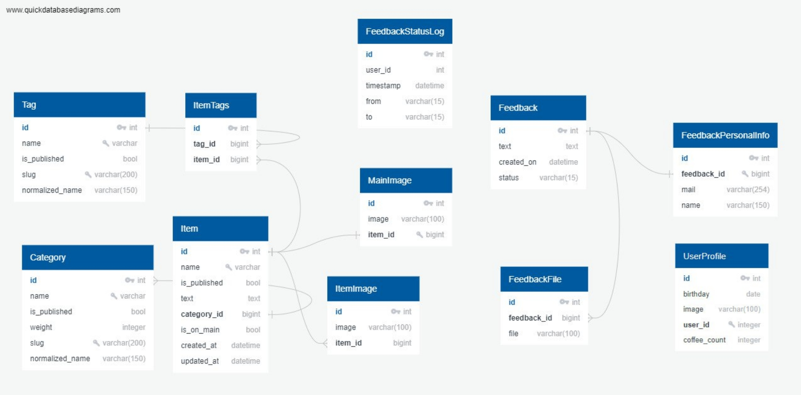

# Ультимативная комманда
```shell
python manage.py boot --dev --username admin 
```

# Создание виртуальной среды
```sh
python -m venv venv
```

# Активация виртуальной среды
```sh
source venv/bin/activate
```

# Установка зависимостей
```sh
pip install -r requirements/prod.txt
```

- для запуска проекта в режиме разработки или тестировки используйте файлы test.txt и dev.txt соответственно 

# Настройка ключа
Откройте файл test.env, в поле "SECRET" впишите свой секретный ключ и переименуйте файл в ".env"
```sh
mv test.env .env
```

# Запуск миграций
```sh
cd lyceum
python3 manage.py migrate
```


# Загрузка фикстур
```sh
cd lyceum
python3 manage.py loaddata fixtures\data.json
```

# Запуск хоста
```sh
cd lyceum
python manage.py thumbnail clear
python manage.py runserver
```

# Схема базы данных


# Перевод
Сайт поддерживает русский и английский языки
Для генерации перевода введите
```sh
django-admin compilemessages
```